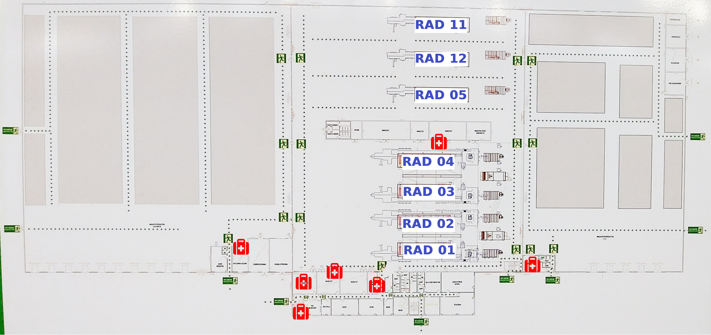
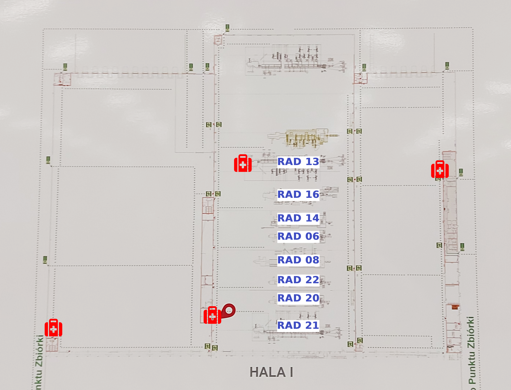

import React from "react";
import Quiz from "@site/src/components/Quiz";
import { questionsSprzet } from "@site/src/components/QuizSprzet";

W tej sekcji znajdują się podstawowe informacje dotyczące bezpieczeństwa na terenie zakładu, obejmujące lokalizację sprzętu BHP oraz zasady ewakuacji.

---

## 🔥 Lokalizacja gaśnic

Gaśnice są umieszczone w strategicznych miejscach oznaczonych czerwonymi tabliczkami.

**Zasady:**

- nie zastawiać gaśnic,
- zgłaszać uszkodzenia lub brak dostępu,
- regularnie zwracać uwagę na ich stan.

---

### 🗺️ Plan lokalizacji gaśnic

---

## 🩹 Lokalizacja apteczek i punktów pierwszej pomocy

Apteczki znajdują się w widocznych i łatwo dostępnych miejscach.

**Pamiętaj:**

- zawsze sprawdź, gdzie jest najbliższa apteczka,
- po użyciu zgłoś konieczność uzupełnienia,
- nie przenoś apteczki bez zgody przełożonego.

### 🗺️ Plan lokalizacji apteczek

Stara hala

Nowa hala

---

---

## 📍 Punkt zbiórki

Punkt zbiórki znajduje się poza budynkiem, oznaczony zieloną tabliczką.

**Procedura:**

1. opuść budynek najbliższą drogą ewakuacyjną,
2. nie wracaj po rzeczy osobiste,
3. udaj się bezpośrednio do punktu zbiórki,
4. zgłoś swoją obecność przełożonemu.

---

## 🚪 Wyjścia ewakuacyjne

Wyjścia ewakuacyjne muszą być drożne i dobrze oznaczone.

**Zasady:**

- nie zastawiać wyjść,
- znać drogę ewakuacyjną,
- kierować się znakami w razie alarmu.

---

## Quiz

<Quiz questions={questionsSprzet} />
