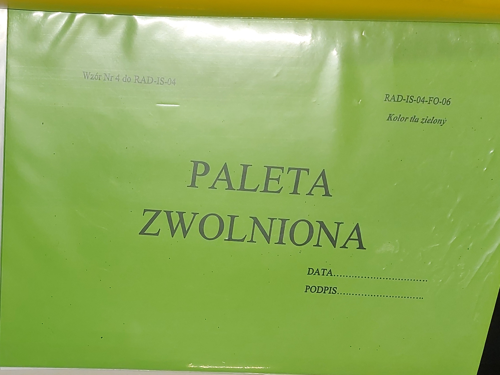

## Zgłaszanie niezgodności produktu / otwieranie blokad jakościowych 📝

Zgłaszamy niezgodność:

- liderowi zmiany
- do **QPA (Quality Product Assurance / laboratorium)**

Wypełniamy:

- formularz **„Zgłoszenie niezgodności”**
- odpowiednią kartę: 🔵 niebieską, 🟡 żółtą lub 🔴 czerwoną

Oznaczamy wyrób niezgodny oraz oznakowujemy palety właściwymi kartami i stawiamy je na wyznaczonym miejscu dla zablokowanych palet (naklejone żółte taśmy na podłodze).

---

## Niebieska karta 🔵

Stosujemy, gdy na linii odbywają się:

- walidacje nowego produktu
- testy
- próby nowych materiałów

W takim przypadku:

- wypełniamy **wyłącznie niebieską kartę** 🔵
- **nie zgłaszamy do laboratorium**

---

## Czerwona karta 🔴

Jeżeli jest **10 lub mniej kartonów z wadami**, wyrzucamy do kosza bez wypisywania karty.

Stosujemy, gdy produkt ma **wadę krytyczną**, np.:

- brak jednej lajkry w cuff/leg
- dziury
- brak pierwszej lub ostatniej lajkr w tummy  
  _pełna lista wad krytycznych znajduje się w katalogu wad_

Jeżeli znaleziono **wadę krytyczną**:

- zgłaszamy to liderowi zmiany
- wypełniamy **„Zgłoszenie niezgodności”**
- na każdej palecie umieszczamy **czerwoną kartę**

---

## Żółta karta 🟡

Stosujemy, gdy wystąpiła **niezgodność niekrytyczna**.

W takim przypadku:

- zgłaszamy liderowi linii
- wypełniamy **„Zgłoszenie niezgodności”**
- zgłaszamy do laboratorium
- na każdej palecie umieszczamy **żółtą kartę**

Laboratorium po testach decyduje:

- czy wyrób kierujemy **do kosza**
- czy można go **zwolnić** (patrz sekcja poniżej)

---

## Zwalnianie wyrobu gotowego 🟢

Jeśli laboratorium zaakceptowało produkt:

- wieszamy **zieloną kartę**
- oraz wypełniony formularz "**Paleta czeka na systemowe złomowanie kartonów**"

W formularzu podajemy:

- liczbę kartonów pobranych do testów
- liczbę kartonów, które pozostały na palecie

  _(np. 24 kartony na kompletnej palecie − 4 kartony pobrane do testów = 20 kartonów fizycznie na palecie)_

- datę i nasz podpis

---

## Obsługa zgrzewarki manualnej 🔧

1. Umieszczamy luźną część worka między korpusem maszyny a grzałką.
2. Zaginamy brzegi tworząc „kopertę”.
3. Naciskamy nogą dźwignię – powstaje zgrzew.
4. W trakcie zgrzewania przesuwamy biały, plastikowy element po odwrotnej stronie grzałki, przecinając worek.
5. Gdy worek nie został przecięty prawidłowo – nóż jest stępiony.
6. Wtedy pozostałość worka odcinamy nożyczkami.
7. Wymianę noża wykonuje 🔧 **TSD** (Technical Service Department).
